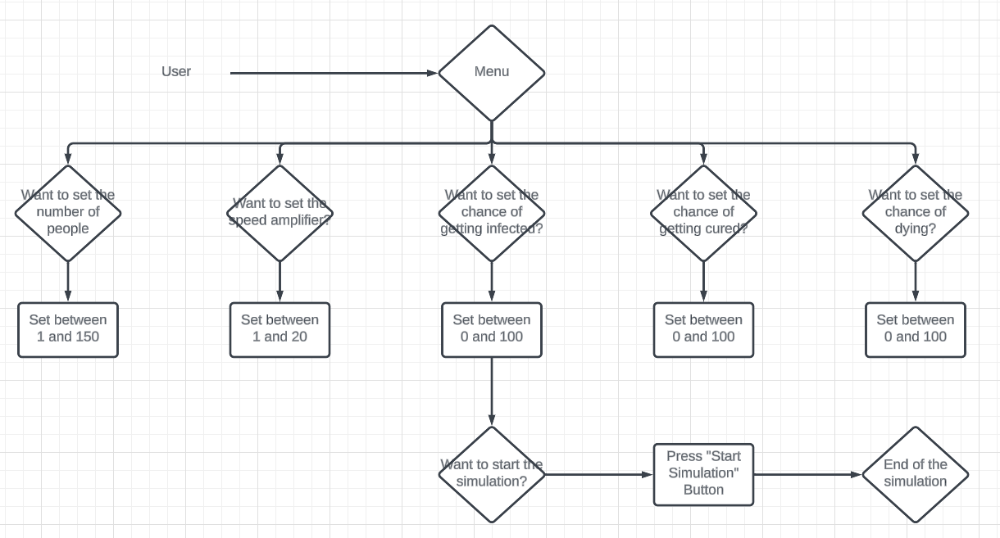

# Virus Spread Simulation
This project is suppose to represent a simulation where we could see how viruses are spread. This was driven by the idea of COVID-19 which we all suffer from and where many simulations were done to prove different things, like how the virus may spread (speed), how social distance impact the development of the disease, and how in some countries the disease ended up being more lethal than in others. Therefore this simulation doesn’t intend to create a new way to analyze infection diseases but to show us with graphics how other people analyzed it in that time. In this simulation we tried to leave some important values in the main in order to model different viruses and their impact.

# Demo
[Virus Spread Simulation](https://youtu.be/e9jqFZ_7i00)

# Tasks
- User Stories:

- UML Activity Diagram
  

- Refactoring
  Through out the projects development we maintained the same coding style to improve our workflow.

- Design Pattern

- Use of AI
