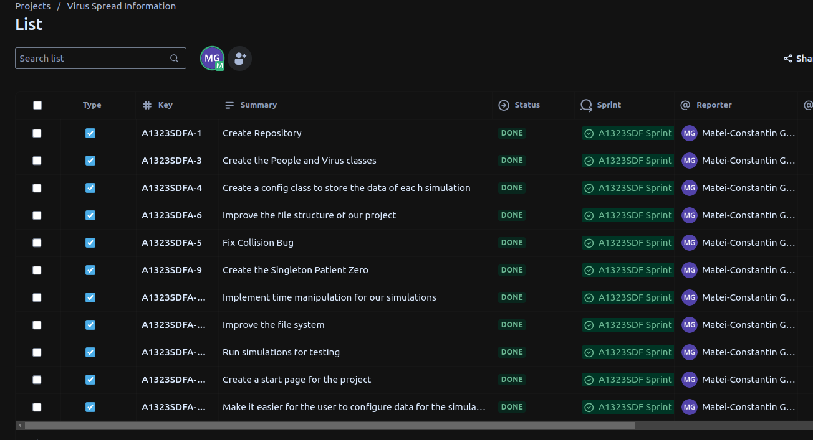
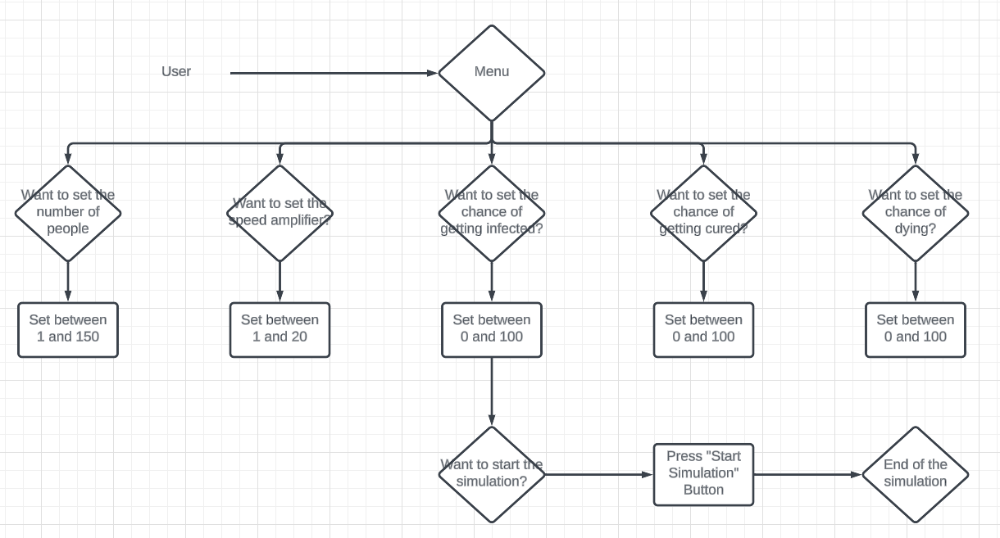
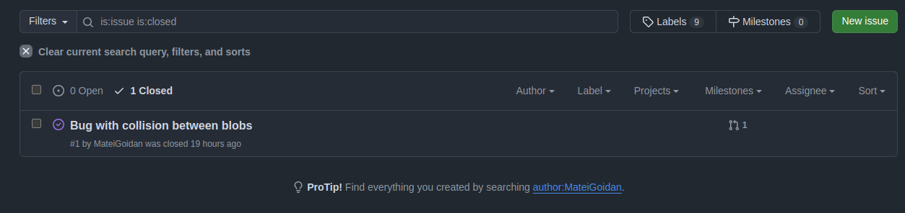
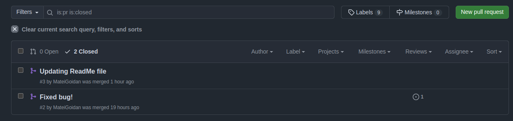
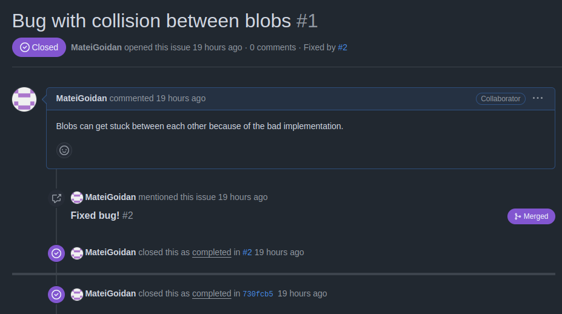
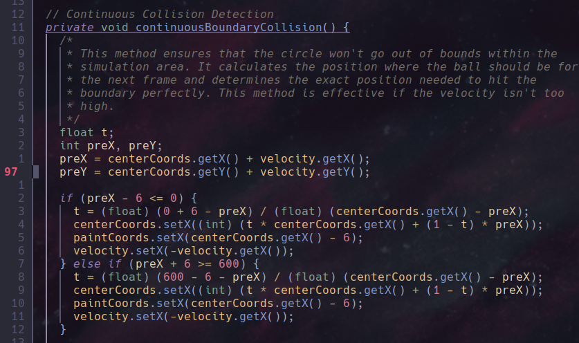
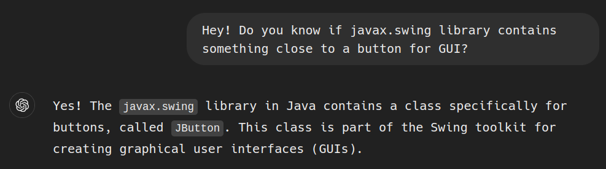

# Virus Spread Simulation
This project is supposed to represent a simulation where we could see how viruses are spread. This was driven by the idea of COVID-19 which we all suffer from and where many simulations were done to prove different things, like how the virus may spread (speed), how social distance impact the development of the disease, and how in some countries the disease ended up being more lethal than in others. Therefore this simulation doesn’t intend to create a new way to analyze infection diseases but to show us with graphics how other people analyzed it in that time. In this simulation we tried to leave some important values in the main in order to model different viruses and their impact.

# Demo
[Virus Spread Simulation](https://youtu.be/e9jqFZ_7i00)

# Tasks
- User Stories:
  

- UML Activity Diagram
  

- Source Control with Git:
  - issue:
  
  - pull requests:
  

- Bugs report and fixing them
  

- Refactoring

Through out the projects development we maintained the same coding style to improve our workflow. We used camelcase for naming the variables. To be noted that class names start with a capital letter while variables 

We also made sure to also keep the file structure of our project as clean as possible by restructuring it multiple times [as seen here](https://github.com/MarianaValle99/Programming/commit/471a407fa69521fd6b957ea11c493202a6f265de)

- Design Pattern

Implemented a singleton class in case the simulation starts with only one person infected. This ensures that the program creates only one case of this class by implementing the standard structure of a singleton in Java.
```java 
public class PatientZero extends Person {
  private static PatientZero instance;

  private PatientZero(int length, int height, SimulationConfig config) {
    super(length, height, config);
    // Ensure PatientZero is always sick
    this.status = "sick";
    this.color = Color.RED;
  }

  public static PatientZero getInstance(int length, int height, SimulationConfig config) {
    if (instance == null) {
      instance = new PatientZero(length, height, config);
    }
    return instance;
  }
}
```

- Comments 

All the files contain comments to help the person reading the code better understand what the functionality behind it is.



- Use of AI

Used AI mainly for learning faster the way the swing library from Java works.
  

